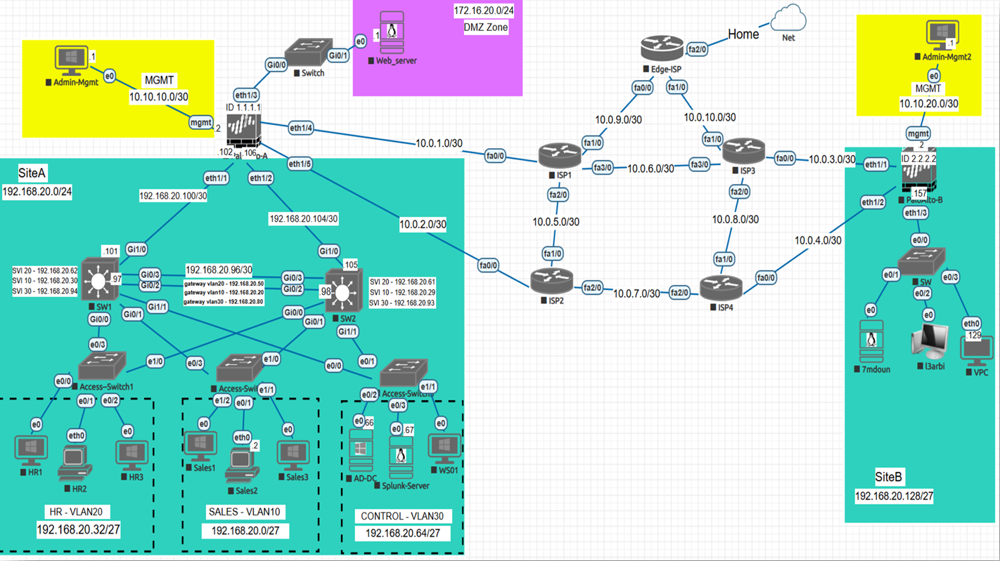

# Enterprise Network Administration & Security Lab
A comprehensive network infrastructure implemented on the **EVE-NG** platform, featuring a centralized **Active Directory** environment (`LAB.local`), multi-site connectivity, and advanced security enforced by **Palo Alto Firewalls**.

## 🌐 Topology Overview
 

## 🛠️ Technical Stack
* **Network Platforms**: EVE-NG, Cisco IOS (Routers & Switches)
* **Identity & Management**: Active Directory (Windows Server 2016), DNS, Group Policy
* **Security**: Palo Alto Firewalls (Zones, Policies, Site-to-Site IPsec VPN)
* **L3 Routing**: OSPF (Dynamic Routing), Static Routing, Inter-VLAN Routing
* **L2 Technologies**: EtherChannel (LACP), VTP, HSRP (Gateway Redundancy), VLAN Segmentation

## 📂 Project Structure
* [**Configurations**](./configs/) - Concept-based command sets for each device tier.
* [**Documentation**](./documentation/) - Full project report and the EVE-NG `.unl` lab file.
* [**Topology**](./topology/) - High-resolution network diagrams.

## 🚀 Key Features
* **Active Directory Integration**: Centralized user management and security via Domain Controller `DC01` and custom GPOs.
* **Redundancy**: Implemented at both Layer 2 (EtherChannel) and Layer 3 (HSRP/OSPF) to ensure high availability.
* **Security Zones**: Strict traffic control between LAN, WAN, and DMZ using Palo Alto security policies.
* **Site-to-Site VPN**: Encrypted IKEv2 tunnel connecting SiteA and SiteB.

## 📺 Demonstration
[View Project Demo on LinkedIn](https://www.linkedin.com/posts/abdelilah-assioui-a326493a8_networking-networksecurity-vpn-ugcPost-7433192101074350080-g32T?utm_source=share&utm_medium=member_desktop&rcm=ACoAAGPDToYB2zscoQcTYyReLwt3GZ1vzN7Lk_A)
